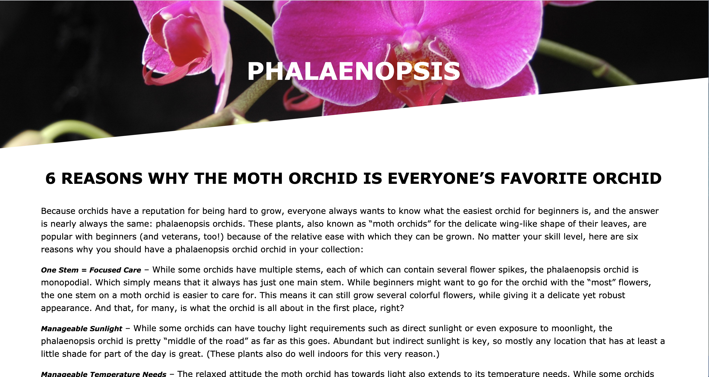
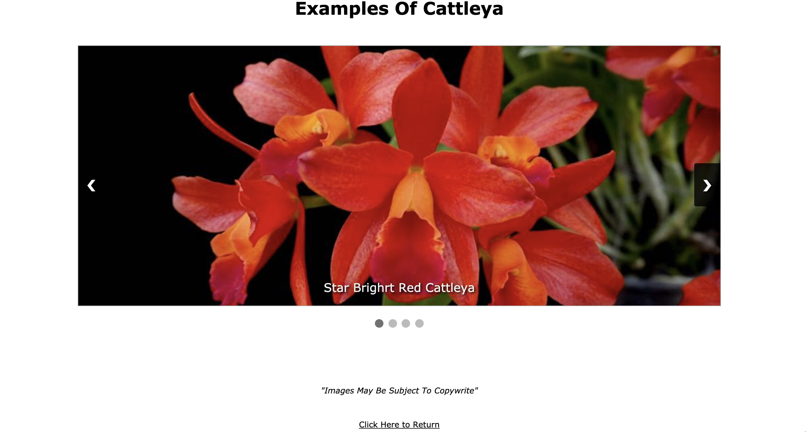

###**NAME** : My Orchid Blog - Front End Project

###**DESCRIPTION** : Front End Blog about my favorite Orchids.
- Built using html, CSS, JS.
- It includes an on-load animation of the project name. This was created at Animista Animated Text.
- Animated burger menu
- A collapsing vertical Nav Bar on the right side of screen.
- Individual sections connecting via anchor links to separate full page files.
- Individual full page sections have slanted header, text on subject, small image carousel, and active anchor links connecting back to corresponding landing section in main html file.
- Leave a Comment Form, made possible by htmlcommentbox.com, with customized styling.
- Contact Form, made possible by formspree.com, with customized styling.
- Active Social Media links with on-hover button effects.
- RESPONSIVE: project built using responsive fonts (rem), flex-box layout, responsive images using css object-fit property, and auto height or width. MEDIA QUERY break point at 600 pixels or less.

###**VISUAL GUIDES**

- Screen shot of landing section in main file, with animated text.
---

- Screen shot of lower section with vertical nav open.
___

- Screen shot of individual full page file slanted header (upper half).
___

- Screen shot of individual full page file, image carousel (lower half).
___

###**ACKNOWLEDGEMENTS**:
####Source Material
- Content provided by:  orchidcarezone.com
- Images are from various sources. Images May Be Subject To Copy Write.
- Comment Form provided by: htmlcommentbox.com
- Contact Form provided by: formspree.com
- Animated text provided by: animista.net
